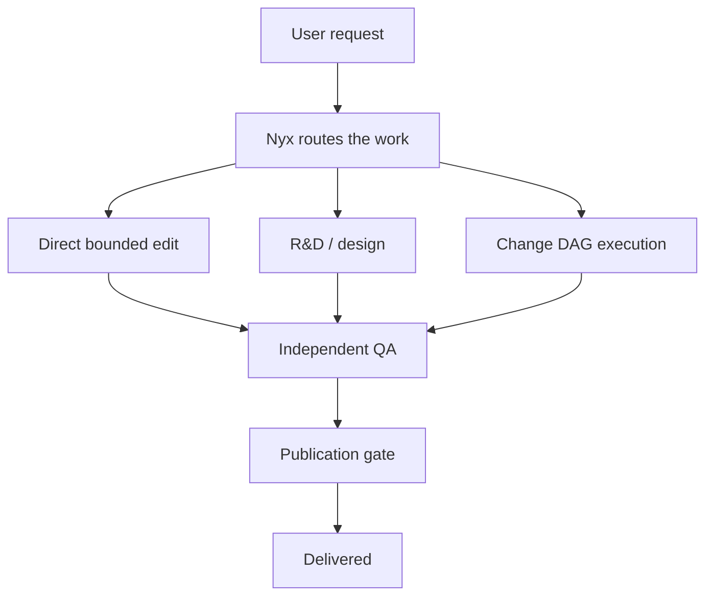
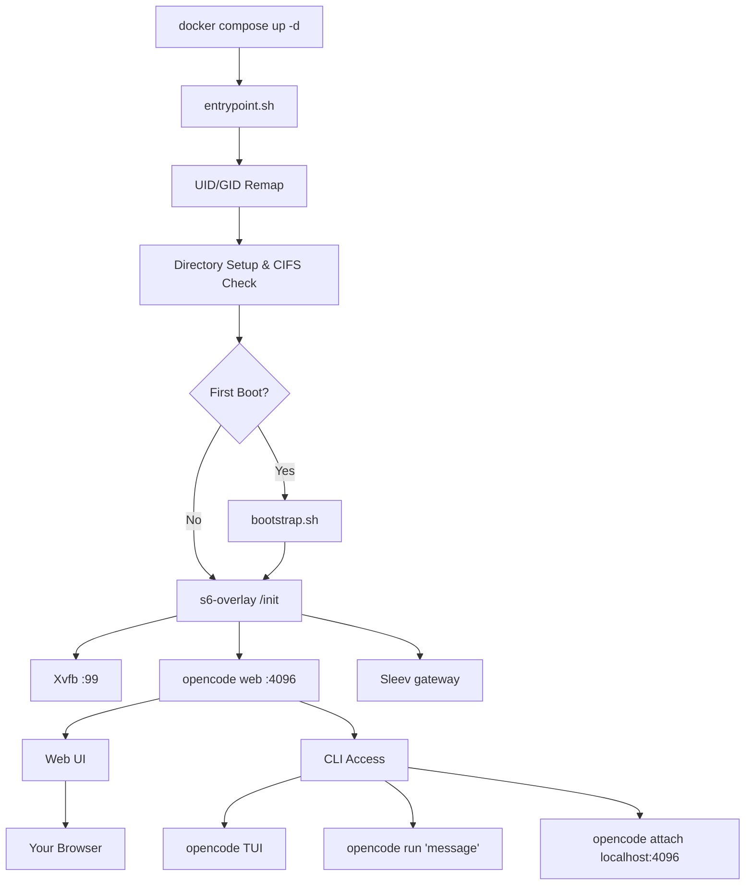

<a name="top"></a>

# SkyScow

<div align="center">

**An agentic software-engineering harness built around [OpenCode](https://opencode.ai).**

</div>

<p align="center">

[](https://github.com/xiaden/SkyScow/actions/workflows/validation.yml)
[](https://github.com/xiaden/SkyScow/tags)
[](https://github.com/xiaden/SkyScow/pkgs/container/skyscow)
[](https://opensource.org/licenses/MIT)
[](https://github.com/xiaden/SkyScow)
[](https://github.com/xiaden/SkyScow/issues)

</p>

### One container. Every tool. Any provider.

An agentic software-engineering harness built around OpenCode — containerized with 50+ dev tools, 10+ AI providers, headless browser, and persistent state pre-configured.

---

## What is this?

SkyScow is an agentic software-engineering harness built around [OpenCode](https://opencode.ai), an AI coding agent with a built-in web UI. It packages the agent runtime, the shipped agent/command/skill configuration, and supporting tooling into a single container alongside 50+ dev tools, a headless browser stack, process supervision, and provider-agnostic model support.

Your settings, sessions, MCP configs, plugins, and tool history live in a bind mount outside the container. Rebuild, update, or move machines — your state persists.

OpenCode is provider-agnostic: point it at Anthropic, OpenAI, Google Gemini, Groq, AWS Bedrock, Azure OpenAI, or any OpenAI-compatible endpoint.

---

## The Shipped Harness

SkyScow is not just a container full of tools — it ships a complete multi-agent software-engineering harness on top of OpenCode. Day-to-day work starts with the default agent, **`nyx`**, which routes each request to the right department before acting: a routine fix stays local, while a large or risky change moves through research, design, decomposition, execution, and independent QA.

### Agents by department

| Department | Agents | Role |
|---|---|---|
| Orchestration | `nyx` | Default entry point; applies project rules and routes work before acting |
| R&D | `rnd-manager`, `rnd-dd-author`, `rnd-architect`, `rnd-ideator`, `rnd-refiner`, `rnd-counter-ideator`, `rnd-counter-improver`, `rnd-improver`, `rnd-estimator`, `rnd-complexity-advisor` | Research, adversarial design, design documents, and effort sizing |
| Execution | `change-dag-author`, `change-dag-reviewer` | Author and optionally review a Change DAG; Nyx controls lifecycle |
| QA | `qa-reviewer` (+ correctness, boundary, journey, domain-risk lenses), `qa-push-manager`, `qa-repo-review-manager` (+ whole-tree reviewers), `qa-test-analyzer` / `qa-test-generator`, `qa-docs-analyzer` / `qa-docs-generator` | Independent review, test and docs gap repair, and publication gating |
| Support | `support-researcher`, `support-librarian`, `support-pattern-enforcer`, `support-debugger` | Research, artifact navigation, impact analysis, and root-cause debugging |

### Processes

**Research → design → decomposition → Change DAG → execution.** Substantial features start with research and an adversarial design pass, producing a design document (DD) that records the trade-offs and the decision. An accepted DD is decomposed into a Change DAG: a semantic graph of requirements plus exact work nodes. Nyx admits and stewards it through the lifecycle tools; `dag_executor` then executes it deterministically and serially. The Change DAG is how SkyScow structures a change that is too large to hold in one context window — it is one process among several, not the only way work gets done.

### How work flows

A simplified view of how Nyx routes engineering work:



Small bounded work can stay direct; larger work moves through R&D and a Change DAG. Independent QA and publication are separate from implementation, and the support bench is available wherever repository research, artifact navigation, impact analysis, or root-cause debugging is needed.

Detailed lifecycle documentation:

- [R&D and design documents](docs/architecture/rnd-and-design.md)
- [Change DAG lifecycle](docs/architecture/change-dag-lifecycle.md)
- [QA and publication](docs/architecture/qa-and-publication.md)

**Independent QA.** Every meaningful change gets independent correctness review, plus boundary, journey, and domain-risk lenses where the changed surface triggers them. Test and docs analyzers each inspect their own domain and dispatch a generator to repair concrete gaps. `/qa-push` is the final publication gate over a candidate commit, and `/qa-repo-review` runs a whole-tree review of a repository at an explicit GitHub ref.

**Support bench.** `support-researcher` gathers codebase and external facts, `support-librarian` navigates the artifact corpus (logs, ADRs, ASRs, DDs, and prior work), `support-pattern-enforcer` maps the impact of a proposed change, and `support-debugger` traces failures to a root cause.

**Git and GitHub.** The `gg-*` skill family (`gg-router`, `gg-core`, `gg-env`, `gg-repos`, `gg-actions`, `gg-artifacts`, `gg-docs`) covers local Git, credentials, collaboration, Actions, and attested artifacts. It loads on demand.

**Commands.** The user-facing commands include `/correct`, `/bulk_correct`, `/pr-resolve-issue`, `/commit-resolve-issue`, `/qa-push`, and `/qa-repo-review`, plus the general `ecc/*` commands (`/ecc/eval`, `/ecc/fix-build`, `/ecc/quality-gate`, and others).

**Tissue.** SkyScow bundles Tissue's resident OpenCode plugin, triage agent, and resolve agent from the pinned `vendor/tissue` submodule. The Tissue controller remains a separate service/container; SkyScow's bootstrap owns the resident-side plugin and agents. See the [Tissue integration guide](docs/tissue-integration.md) for the deployment boundary and update procedure.

Skills load on demand — SkyScow ships 29 of them — and a set of Python-backed tools backs the work: ADRs, ASRs, design documents, Change DAGs, durable logs, QA round records, context budgeting, and request-context capture.

---

## Table of Contents

| | Section |
|---|---------|
| 1 | [The Shipped Harness](#the-shipped-harness) |
| 2 | [Quick Start](#quick-start) |
| 3 | [Platform Support](#platform-support) |
| 4 | [Why SkyScow](#why-skyscow) |
| 5 | [Provider Support](#provider-support) |
| 6 | [Docker Compose - Quick](#docker-compose---quick) |
| 7 | [Docker Compose - Full](#docker-compose---full) |
| 8 | [Environment Variables](#environment-variables) |
| 9 | [What's Inside](#whats-inside) |
| 10 | [Architecture](#architecture) |
| 11 | [CLI Usage](#cli-usage) |
| 12 | [Data and Persistence](#data-and-persistence) |
| 13 | [Permissions](#permissions) |
| 14 | [Upgrading](#upgrading) |
| 15 | [Troubleshooting](#troubleshooting) |
| 16 | [Building Locally](#building-locally) |
| 17 | [Contributing](#contributing) |
| 18 | [Support](#support) |
| 19 | [License](#license) |

---

## Quick Start

**Step 1.** Pull the image.

```bash
docker pull ghcr.io/xiaden/skyscow:latest
```

**Step 2.** Create a `docker-compose.yaml`.

```yaml
services:
  skyscow:
    image: ghcr.io/xiaden/skyscow:latest
    container_name: skyscow
    restart: unless-stopped
    shm_size: 2g
    security_opt:
      - seccomp=./config/chromium-seccomp.json   # Chromium sandbox (required)
    ports:
      - "127.0.0.1:4096:4096"   # local-only by default
    volumes:
      - ./data/opencode:/home/opencode
      - ./local-cache/opencode:/home/opencode/.cache/opencode
      - ./workspace:/workspace
    environment:
      - PUID=1000
      - PGID=1000
      - ANTHROPIC_API_KEY=your-key-here
    secrets:
      - github_token

secrets:
  github_token:
    file: ${GITHUB_TOKEN_FILE:-/dev/null}
```

> The `security_opt` line points at `config/chromium-seccomp.json`. If you are not running from a clone of this repo, download that profile as shown in [Docker Compose - Quick](#docker-compose---quick); Chromium's sandbox will not start without it.

In that example, `/home/opencode` is the fixed path **inside** the container. On the host, `./data/opencode` and `./local-cache/opencode` are just example bind-mount paths relative to the folder containing your `docker-compose.yaml`. You can replace them with any host paths you want.

**Step 3.** Start it.

```bash
docker compose up -d
```

Open http://localhost:4096. You're in.

> The shipped `docker-compose.yaml` uses `${ANTHROPIC_API_KEY}` syntax which reads from your shell environment or a `.env` file. Copy `.env.example` to `.env` and fill in your API key.

> `./data/opencode` is only an example host path. If your compose file lives at `/opt/skyscow`, that same bind mount becomes `/opt/skyscow/data/opencode` on the host.

> Keep `./local-cache/opencode` on local disk. If this project folder lives on NAS/CIFS/SMB storage, change that cache mount to an absolute local host path instead.

> If you need GitHub CLI access, set `GITHUB_TOKEN_FILE=./secrets/github_token` in `.env`, create that file with a fine-grained token, and use `umask 077` so only your user can read it. Compose mounts it read-only at `/run/secrets/github_token` and SkyScow does not copy it into persistent OpenCode state. Do not put the token in `.env`. The file and variable are optional; omit them when GitHub access is not needed.

> **Local access only by default.** `127.0.0.1:4096:4096` publishes the web UI on the Docker host's loopback interface, so other machines cannot reach the agent. To allow remote access, publish a wider bind **and** set `OPENCODE_SERVER_PASSWORD` — an unauthenticated OpenCode server can execute code with your workspace and provider credentials. See [Environment Variables](#environment-variables).

---

## Platform Support

| Platform | Architecture | Status |
|----------|-------------|--------|
| Linux | amd64 | Supported |
| Linux | arm64 | Supported |
| macOS (Docker Desktop) | amd64 / arm64 | Supported |
| Windows (WSL2) | amd64 | Supported |


---

## Why SkyScow

SkyScow packages a complete agentic software-engineering environment into a single container so you skip the setup and get straight to building.

| | SkyScow | DIY |
|---|----------|-----|
| Time to first working session | Under 2 minutes | 30-60 minutes |
| Chromium + Xvfb headless browser | Pre-configured | Research, install, debug yourself |
| Dev tool suite (ripgrep, fzf, lazygit, etc.) | Pre-installed | Hunt down and install one by one |
| State persistence across rebuilds | Automatic via bind mount | Manual bind mounts, easy to misconfigure |
| UID/GID file permission remapping | Built-in PUID/PGID | Dockerfile chmod hacks |
| Multi-arch support | amd64 + arm64 out of the box | Build and push both yourself |
| Updates | `docker pull` + `compose up` | Rebuild from scratch, hope nothing breaks |


---

## Provider Support

OpenCode is provider-agnostic. Set whichever API key you use and you're done.

| Provider | Environment Variable | Notes |
|----------|---------------------|-------|
| Anthropic | `ANTHROPIC_API_KEY` | Claude models |
| OpenAI | `OPENAI_API_KEY` | GPT models |
| Google Gemini | `GEMINI_API_KEY` | Gemini models |
| Groq | `GROQ_API_KEY` | Fast inference |
| AWS Bedrock | `AWS_ACCESS_KEY_ID`, `AWS_SECRET_ACCESS_KEY`, `AWS_REGION` | Set all three |
| Azure OpenAI | `AZURE_OPENAI_ENDPOINT`, `AZURE_OPENAI_API_KEY`, `AZURE_OPENAI_API_VERSION` | Set all three |
| GitHub | `GITHUB_TOKEN_FILE` | Optional host path to a runtime-only GitHub token file; mounted at `/run/secrets/github_token` when set |
| Vertex AI | (configured via OpenCode) | Google Vertex AI models |
| GitHub Models | (configured via OpenCode) | GitHub-hosted models |
| Ollama | (configured via OpenCode) | Local models via Ollama |

You only need to set keys for providers you actually use. Everything else is optional and ignored.

Vertex AI, GitHub Models, and Ollama are configured through OpenCode's provider system. Run `opencode providers login` inside the container.


---

## Docker Compose - Quick

The minimal setup. Copy, fill in your key, run.

SkyScow runs Chromium with its setuid sandbox enabled, which needs a
constrained seccomp profile at runtime. If you are not running from a clone
of this repository, download the profile first:

```bash
mkdir -p config
curl -fsSLo config/chromium-seccomp.json \
  https://raw.githubusercontent.com/xiaden/SkyScow/main/config/chromium-seccomp.json
```

```yaml
services:
  skyscow:
    image: ghcr.io/xiaden/skyscow:latest
    container_name: skyscow
    restart: unless-stopped
    shm_size: 2g              # Required for Chromium stability
    security_opt:
      - seccomp=./config/chromium-seccomp.json   # Chromium sandbox (required)
    ports:
      - "127.0.0.1:4096:4096" # OpenCode web UI (local-only; see note below)
    volumes:
      - ./data/opencode:/home/opencode
      - ./local-cache/opencode:/home/opencode/.cache/opencode
      - ./workspace:/workspace  # Your project files
    environment:
      - PUID=1000
      - PGID=1000
      - ANTHROPIC_API_KEY=your-key-here  # Or swap for any provider key
    secrets:
      - github_token

secrets:
  github_token:
    file: ${GITHUB_TOKEN_FILE:-/dev/null}
```

> The port mapping is loopback-only. To reach the web UI from another machine, publish a wider bind **and** set `OPENCODE_SERVER_PASSWORD` first.


---

## Docker Compose - Full

Every option documented. Copy to `docker-compose.yaml` and uncomment what you need.

```yaml
# SkyScow - Full Configuration Reference
# Copy this file to docker-compose.yaml and customize.
# All options documented. Uncomment what you need.

services:
  skyscow:
    image: ghcr.io/xiaden/skyscow:latest
    container_name: skyscow
    restart: unless-stopped
    shm_size: 2g

    ports:
      - "127.0.0.1:4096:4096"   # OpenCode web UI (local-only by default)

    volumes:
      # --- Main SkyScow data ---
      # Pick any host path you want here. This path maps to /home/opencode in the container.
      # It can live on local disk or network storage.
      - ./data/opencode:/home/opencode

      # --- Cache path ---
      # Keep this one on LOCAL disk for plugin/cache reliability.
      # If your main data path lives on NAS/CIFS/SMB, make this a separate local path.
      - ./local-cache/opencode:/home/opencode/.cache/opencode

      # --- Workspace ---
      - ./workspace:/workspace   # Your project files

    environment:
      # --- Container user ---
      - PUID=1000                # Match your host UID for file permissions
      - PGID=1000                # Match your host GID for file permissions

      # --- Git identity (used on first boot) ---
      # - GIT_USER_NAME=Your Name
      # - GIT_USER_EMAIL=you@example.com

      # --- AI provider API keys (add the ones you use) ---
      - ANTHROPIC_API_KEY=${ANTHROPIC_API_KEY:-}
      # - OPENAI_API_KEY=${OPENAI_API_KEY:-}
      # - GEMINI_API_KEY=${GEMINI_API_KEY:-}
      # - GROQ_API_KEY=${GROQ_API_KEY:-}
      # GitHub CLI uses the optional runtime secret mounted at
      # /run/secrets/github_token; do not put the token in .env.

      # --- AWS Bedrock (uncomment all 3 for Bedrock) ---
      # - AWS_ACCESS_KEY_ID=
      # - AWS_SECRET_ACCESS_KEY=
      # - AWS_REGION=us-east-1

      # --- Azure OpenAI (uncomment all 3 for Azure) ---
      # - AZURE_OPENAI_ENDPOINT=
      # - AZURE_OPENAI_API_KEY=
      # - AZURE_OPENAI_API_VERSION=

      # --- OpenCode behavior (overrides image defaults) ---
      # - OPENCODE_MODEL=claude-sonnet-4-6
      # - OPENCODE_PERMISSION=auto
      # - OPENCODE_DISABLE_LSP_DOWNLOAD=true
      # - OPENCODE_DISABLE_AUTOCOMPACT=true
      # - OPENCODE_ENABLE_EXA=true

      # --- Web UI Security (basic auth for opencode web) ---
      # Required whenever the port is published beyond loopback: an
      # unauthenticated opencode web is a code-executing agent surface.
      # - OPENCODE_SERVER_PASSWORD=your-password
      # - OPENCODE_SERVER_USERNAME=opencode
```

The port mapping is loopback-only by default; widen it only together with `OPENCODE_SERVER_PASSWORD`. For the shipped `docker-compose.full.yaml` reference file, see the one included in this repo.


---

## Environment Variables

| Variable | Default | Purpose |
|----------|---------|---------|
| `PUID` | `1000` | Container user UID, match your host for correct file ownership |
| `PGID` | `1000` | Container user GID, match your host for correct file ownership |
| `GIT_USER_NAME` | `SkyScow User` | Git identity configured on first boot |
| `GIT_USER_EMAIL` | `noreply@skyscow.local` | Git identity configured on first boot |
| `ANTHROPIC_API_KEY` | (none) | Anthropic Claude |
| `OPENAI_API_KEY` | (none) | OpenAI GPT models |
| `GEMINI_API_KEY` | (none) | Google Gemini |
| `GROQ_API_KEY` | (none) | Groq fast inference |
| `GITHUB_TOKEN_FILE` | (unset) | Optional host path to a fine-grained GitHub token file; Compose uses `/dev/null` when unset and mounts the configured file read-only at `/run/secrets/github_token` |
| `AWS_ACCESS_KEY_ID` | (none) | AWS Bedrock - set all three AWS vars |
| `AWS_SECRET_ACCESS_KEY` | (none) | AWS Bedrock |
| `AWS_REGION` | (none) | AWS Bedrock region (e.g. `us-east-1`) |
| `AZURE_OPENAI_ENDPOINT` | (none) | Azure OpenAI - set all three Azure vars |
| `AZURE_OPENAI_API_KEY` | (none) | Azure OpenAI |
| `AZURE_OPENAI_API_VERSION` | (none) | Azure OpenAI API version |
| `OPENCODE_MODEL` | (none) | Override the default model |
| `OPENCODE_PERMISSION` | (none) | Set to `auto` to skip permission prompts |
| `OPENCODE_DISABLE_LSP_DOWNLOAD` | (none) | Disable automatic LSP server downloads |
| `OPENCODE_DISABLE_AUTOCOMPACT` | (none) | Disable automatic context compaction |
| `OPENCODE_ENABLE_EXA` | (none) | Enable Exa web search integration |
| `OPENCODE_SERVER_PASSWORD` | (none) | Basic-auth password; required when the web UI is exposed beyond localhost |
| `OPENCODE_SERVER_USERNAME` | `opencode` | Username for web UI basic auth |

> `OPENCODE_DISABLE_AUTOUPDATE` and `OPENCODE_DISABLE_TERMINAL_TITLE` are set to `true` by default in the Docker image. You can override them if needed.

> `GIT_USER_NAME` and `GIT_USER_EMAIL` are only applied on first boot. To re-apply, delete the sentinel file and restart: `docker exec skyscow rm /home/opencode/.config/opencode/.skyscow-bootstrapped` then `docker compose restart`.


---

## What's Inside

<details>
<summary><strong>Core tools</strong></summary>

| Tool | Purpose |
|------|---------|
| `git` | Version control |
| `ripgrep` | Fast file content search |
| `fd` | Fast file finder |
| `fzf` | Fuzzy finder |
| `bat` | Cat with syntax highlighting |
| `eza` | Modern ls replacement |
| `lazygit` | Terminal git UI |
| `delta` | Better git diffs |
| `gh` | GitHub CLI |
| `htop` | Process monitor |
| `tar` | Archive creation and extraction |
| `tree` | Directory tree visualization |
| `less` | Paged file viewer |
| `vim` | Terminal text editor |
| `tmux` | Terminal multiplexer |

</details>

<details>
<summary><strong>Language runtimes</strong></summary>

| Runtime | Version |
|---------|---------|
| Node.js | 22 (LTS) |
| npm | Bundled with Node.js 22 |
| Python | 3 (system) |
| pip | Bundled with Python 3 |

</details>

<details>
<summary><strong>Dev tools</strong></summary>

| Tool | Purpose |
|------|---------|
| `curl` | HTTP requests |
| `wget` | File downloads |
| `jq` | JSON processing |
| `unzip` / `zip` | Archive tools |
| `ssh` | Remote access |
| `build-essential` + `pkg-config` | Native npm addon compilation |
| `python3-venv` | Python virtual environments |
| `procps` | Process tools: ps, top |
| `iproute2` | Network tools: ip, ss |
| `lsof` | Open file diagnostics |
| `strace` | System call tracer |
| `pandoc` | Document converter |
| `ffmpeg` | Media processing |
| `imagemagick` | Image manipulation |
| OpenSSL | Crypto and cert tools (via base image) |

</details>

<details>
<summary><strong>Database tools</strong></summary>

| Tool | Purpose |
|------|---------|
| `sqlite3` | SQLite CLI |
| `postgresql-client` | PostgreSQL client (psql, pg_dump) |
| `redis-tools` | Redis CLI |

</details>

<details>
<summary><strong>Global npm packages</strong></summary>

| Package | Purpose |
|---------|---------|
| `typescript` | TypeScript compiler |
| `tsx` | TypeScript executor |
| `pnpm` | Fast package manager |
| `vite` | Frontend build tool |
| `esbuild` | Fast bundler |
| `eslint` | JavaScript linter |
| `prettier` | Code formatter |
| `prisma` | ORM for Node.js and TypeScript |
| `drizzle-kit` | SQL ORM toolkit |
| `wrangler` | Cloudflare Workers CLI |
| `vercel` | Vercel deployment CLI |
| `netlify-cli` | Netlify deployment CLI |
| `pm2` | Node.js process manager |
| `lighthouse` | Web performance auditing |
| `serve` | Static file server |
| `nodemon` | Auto-restart on file changes |
| `concurrently` | Run multiple commands |
| `dotenv-cli` | Load .env from CLI |

</details>

<details>
<summary><strong>Browser stack</strong></summary>

| Component | Purpose |
|-----------|---------|
| Chromium | Headless browser engine |
| Xvfb | Virtual framebuffer display server |
| Playwright | Browser automation framework |

The browser stack runs headless out of the box. No display server, no GPU, no extra config needed. Playwright and Puppeteer scripts work as expected.

Includes Liberation, DejaVu, Noto, and Noto Color Emoji fonts for correct page rendering and screenshots.

</details>

<details>
<summary><strong>AI coding tools</strong></summary>

| Tool | Purpose |
|------|---------|
| `opencode` | AI coding agent with web UI on port 4096 |
| `sleev` | Context compression gateway |
| `aft` (`@cortexkit/aft`) | Code search and analysis |
| `aft-opencode` (`@cortexkit/aft-opencode`) | AFT OpenCode plugin |
| `bun` | Fast JavaScript runtime (via `bunx`) |

</details>

<details>
<summary><strong>Process management</strong></summary>

| Component | Purpose |
|-----------|---------|
| s6-overlay v3 | Process supervisor and init system |
| Custom entrypoint | UID/GID remapping, git setup, bootstrap |

s6-overlay supervises OpenCode, Xvfb, and the Sleev gateway. If a process crashes, it restarts automatically. Container restart policies stay clean because the supervisor handles it internally.

The Sleev CLI and its native gateway default to matching version 1.7.7. The packaged artifacts are SHA256-checked at image build time. Set `SLEEV_VERSION` to another stable release to have startup fetch, verify, and install the matching official CLI and gateway before s6 starts; failure is fatal. No systemd management is used.

</details>


---

## Architecture



The entrypoint handles user remapping and first-boot setup. s6-overlay supervises Xvfb, the OpenCode web server, and the Sleev context compression gateway. Access the web UI at port 4096.


---

## CLI Usage

The web UI at port 4096 is the primary interface. But you can also use OpenCode directly from the command line inside the container.

### Interactive TUI

```bash
docker exec -it skyscow bash
opencode
```

This opens OpenCode's full terminal UI with all the same features as the web version.

### One-shot commands

Run a single prompt without entering the TUI:

```bash
docker exec -it skyscow bash -c "opencode run 'explain this codebase'"
```

### Attach to the running server

Connect a local TUI session to the already-running OpenCode web server:

```bash
docker exec -it skyscow bash -c "opencode attach http://localhost:4096"
```

This shares the same session as the web UI. Changes in one appear in the other.

### Provider management

List and configure AI providers from inside the container:

```bash
docker exec -it skyscow bash -c "opencode providers list"
docker exec -it skyscow bash -c "opencode providers login"
```

### Useful commands

| Command | What it does |
|---------|-------------|
| `opencode` | Launch the TUI |
| `opencode run 'message'` | One-shot prompt |
| `opencode attach <url>` | Attach TUI to running server |
| `opencode web --port 4096` | Start web server (already running via s6) |
| `opencode serve` | Headless API server |
| `opencode providers list` | Show configured providers |
| `opencode providers login` | Add or switch provider |
| `opencode models` | List available models |
| `opencode models <provider>` | List models for a specific provider |
| `opencode stats` | Show token usage and costs |
| `opencode session list` | List past sessions |
| `opencode export <sessionID>` | Export session as JSON |
| `opencode plugin <module>` | Install a plugin |
| `opencode upgrade` | Upgrade OpenCode (disabled by default in container) |
| `sleev status` | Sleev gateway status |

The agent also has AFT tools available through its plugin. These are **agent tools, not `opencode` subcommands**:

| Agent tool | What it does |
|---------|-------------|
| `aft_search` | Semantic code search |
| `aft_inspect` | Codebase health diagnostics |
| `aft_outline` | Structural code outline |


---

## Data and Persistence

Most OpenCode state lives under `/home/opencode` inside the container. On the host, that data appears wherever you bind-mount `/home/opencode`. In the default examples below, the host path is `./data/opencode`, but you can replace it with any path you want.

Plugin cache is mounted separately at `./local-cache/opencode` by default so you can keep that cache path on local disk even if your main data path is somewhere else.

| Host Path | Container Path | What's in it |
|-----------|---------------|-------------|
| `./data/opencode/.config/opencode`* | `/home/opencode/.config/opencode` | Settings, agents, MCP configs, themes, plugins |
| `./data/opencode/.local/share/opencode`* | `/home/opencode/.local/share/opencode` | SQLite sessions database, MCP OAuth tokens |
| `./data/opencode/.local/state/opencode`* | `/home/opencode/.local/state/opencode` | Frecency data, model cache, key-value store |
| `./local-cache/opencode` | `/home/opencode/.cache/opencode` | Plugin node_modules, auto-installed dependencies |

\* These `./data/opencode/...` paths are example host paths from the sample compose file. If you bind `/home/opencode` to a different host path, the same subdirectories will appear there instead.

Sleev uses versioned layouts under `/home/opencode/.local/share/sleev/{cli,gateway}/<version>/`, with each `current` symlink pointing at the active release. On startup the synchronizer (`sleev-gateway-sync.sh`) selects the build-time-verified release by default, or fetches and verifies the requested `SLEEV_VERSION` from the official manifests. It atomically activates both CLI and gateway; older versions are kept for rollback. A failed fetch, checksum, version check, or activation prevents startup.

Rebuild the container anytime. Run `docker compose pull && docker compose up -d` and your sessions, settings, and configs come back automatically.

**Generated plugin state is reconciled on upgrade.** The shipped config (`opencode.json` and the files under `plugins/`) is reconciled on every start. Bootstrap compares the generated OpenCode SDK dependency in `package.json` with the installed CLI version, then clears stale global and database-known workspace dependency state (`.cache/`, `package.json`, lockfiles, and `node_modules/`). Configuration and plugin source files are preserved; OpenCode recreates the generated state from them when each workspace is loaded. If the persisted OpenCode database has not completed its migration to the image's pinned schema, bootstrap warns and retries workspace reconciliation on the next container restart.

**SQLite WAL note.** The sessions database uses Write-Ahead Logging. Don't copy the `.db` file while the container is running. Stop the container first if you need to back up or migrate the database file.

**Network storage note.** If `./data/opencode` is on a CIFS/SMB network mount (NAS, Synology, TrueNAS), you need two mount options:
- `nobrl` — SQLite WAL mode requires this (byte-range locking workaround)
- `mfsymlinks` — plugin installation requires this (symlink support for node_modules)

Keep `./local-cache/opencode` on local disk. If your whole SkyScow folder lives on network storage, change that cache mount to an absolute local host path such as `/var/lib/skyscow-cache/opencode:/home/opencode/.cache/opencode`.

See the Troubleshooting section below.


---

## Permissions

SkyScow uses `PUID` and `PGID` to remap the internal container user to match your host user. This means files written to `./workspace` are owned by you, not by root.

Find your IDs on Linux and macOS:

```bash
id -u   # PUID
id -g   # PGID
```

On most systems this is `1000:1000`. On macOS it's often `501:20`. Set them in your compose file:

```yaml
environment:
  - PUID=501
  - PGID=20
```

If you skip this, files in your workspace may be owned by root and you'll need sudo to edit them from the host.


---

## Upgrading

Pull the latest image and recreate the container. Your data stays untouched.

```bash
docker compose pull
docker compose up -d
```

That's it. One command. Your sessions, settings, and configs are in the bind mount so nothing is lost.


---

## Troubleshooting

<details>
<summary><strong>Chromium crashes or browser automation fails</strong></summary>

The most common cause is not enough shared memory. Chromium needs at least 1-2 GB of `/dev/shm` to run reliably.

Make sure your compose file has `shm_size: 2g`:

```yaml
services:
  skyscow:
    shm_size: 2g
```

Without this, Chromium will crash silently or produce broken screenshots.

</details>

<details>
<summary><strong>Permission denied on workspace files</strong></summary>

Your `PUID` and `PGID` don't match your host user. Find your IDs:

```bash
id -u && id -g
```

Update your compose environment section to match:

```yaml
environment:
  - PUID=1001   # replace with your actual UID
  - PGID=1001   # replace with your actual GID
```

Then recreate the container: `docker compose up -d --force-recreate`

</details>

<details>
<summary><strong>Port 4096 already in use</strong></summary>

Something else on your machine is using port 4096. Remap to a different host port:

```yaml
ports:
  - "4097:4096"   # access via http://localhost:4097
```

Or find and stop the conflicting process:

```bash
# Linux / macOS
lsof -i :4096

# Windows
netstat -ano | findstr :4096
```

</details>

<details>
<summary><strong>Container starts but web UI never loads</strong></summary>

Check the container logs:

```bash
docker compose logs -f skyscow
```

OpenCode takes a few seconds to initialize. Give it 10-15 seconds after `docker compose up -d` before opening the browser. If it's still not up, the logs will tell you why.

</details>

<details>
<summary><strong>How does Chromium's sandbox work in the container?</strong></summary>

SkyScow runs Chromium with its built-in setuid sandbox enabled, together with the constrained seccomp profile shipped at `config/chromium-seccomp.json`. Both `shm_size: 2g` and the `security_opt` seccomp entry in the compose file are required for the browser sandbox to run correctly.

The container does **not** need broad privileges. In particular:

- Do **not** add `--no-sandbox` or otherwise disable Chromium's sandbox.
- Do **not** add `cap_add: SYS_ADMIN`.
- Do **not** use `seccomp=unconfined`.

The setuid sandbox plus the constrained profile are the isolation boundary, and weakening them is never a supported workaround. If browser automation fails, check `shm_size` and the `security_opt` entry first (see [Docker Compose - Quick](#docker-compose---quick)).

</details>

<details>
<summary><strong>SQLite WAL or plugins fail on CIFS/SMB network mounts (NAS)</strong></summary>

If your `./data/opencode` directory lives on a CIFS/SMB network share (e.g. NAS, Synology, TrueNAS), OpenCode may fail with:

```
Failed to run the query 'PRAGMA journal_mode = WAL'
```

OpenCode uses SQLite with Write-Ahead Logging (WAL) for its sessions database. WAL requires byte-range locking, which CIFS/SMB doesn't support by default.

SkyScow detects this at startup and prints a warning with the fix instructions.

**Fix:** Add `nobrl,mfsymlinks` to your CIFS mount options in `/etc/fstab`:

```
# Before
//192.168.1.100/share /mnt/share cifs credentials=/etc/smbcreds,uid=1000,gid=1000 0 0

# After — add nobrl and mfsymlinks
//192.168.1.100/share /mnt/share cifs credentials=/etc/smbcreds,uid=1000,gid=1000,nobrl,mfsymlinks 0 0
```

Then remount:

```bash
sudo umount /mnt/share
sudo mount /mnt/share
```

Restart SkyScow: `docker compose up -d --force-recreate`

If you are using the default SkyScow Compose files, the cache mount is `./local-cache/opencode:/home/opencode/.cache/opencode`. Keep that path on local disk. If your entire SkyScow folder lives on network storage, replace it with an absolute local host path.

</details>

<details>
<summary><strong>A plugin I removed or updated still leaves files behind</strong></summary>

The shipped config is reconciled on every start, and generated plugin state is checked against the installed OpenCode version. Bootstrap owns the generated `node_modules/`, `package.json`, lockfiles, and `.cache` state under `/home/opencode/.config/opencode` and each workspace `.opencode` directory discovered from OpenCode's database. It removes stale state but never removes `opencode.json`, project configuration, or plugin source files.

`opencode.json` decides which plugins load. If the database is unavailable or still on an older schema during an image upgrade, bootstrap logs a warning and leaves workspace state untouched until the next restart after OpenCode has migrated the database.

For a manual reset, delete the generated state and let OpenCode rebuild it:

```bash
docker exec skyscow rm -rf \
  /home/opencode/.config/opencode/package.json \
  /home/opencode/.config/opencode/node_modules \
  /home/opencode/.config/opencode/package-lock.json \
  /home/opencode/.config/opencode/bun.lock \
  /home/opencode/.config/opencode/bun.lockb \
  /home/opencode/.cache/opencode
docker compose up -d --force-recreate
```

This re-installs the plugins declared by `opencode.json` on the next start, so network access is required. SkyScow treats the generated package manifest and dependency tree as disposable; add plugin declarations to configuration rather than relying on edits to `package.json`.

</details>


---

## Building Locally

Clone the repo, build the image, swap it into your compose file.

```bash
git clone https://github.com/xiaden/SkyScow.git
cd SkyScow
docker build -t skyscow:local .
```

Then in your `docker-compose.yaml` swap the image:

```yaml
image: skyscow:local
```


---

## Contributing

1. Fork the repo
2. Create a branch: `git checkout -b feature/your-feature`
3. Commit your changes: `git commit -m "feat: your feature"`
4. Push: `git push origin feature/your-feature`
5. Open a pull request


---

## Support

If SkyScow saved you from another hour of environment setup, here's how to pay it forward.

- Star the repo on GitHub
- Share it with someone who'd find it useful


---

## License

MIT License - see [LICENSE](LICENSE).


---

<div align="center">

SkyScow was originally derived from [HolyCode](https://github.com/CoderLuii/HolyCode) by CoderLuii and subsequently developed as an independent project.

Not affiliated with or endorsed by HolyCode or CoderLuii. · MIT Licensed

</div>
