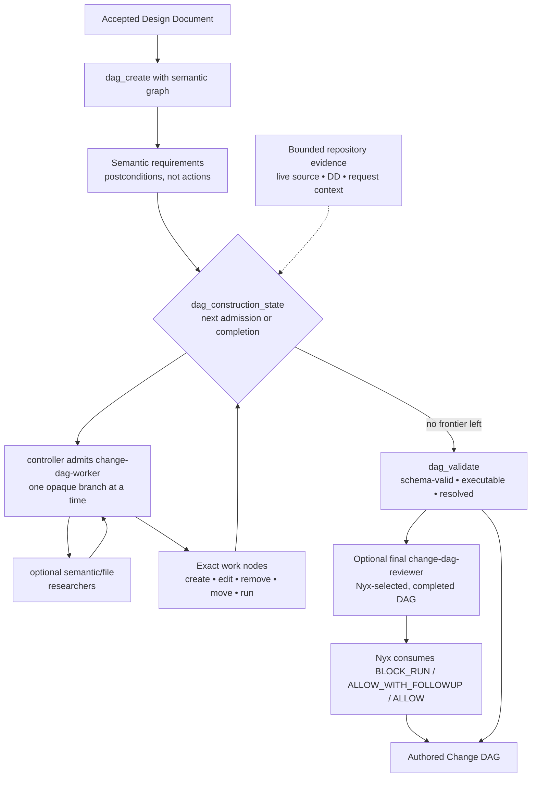
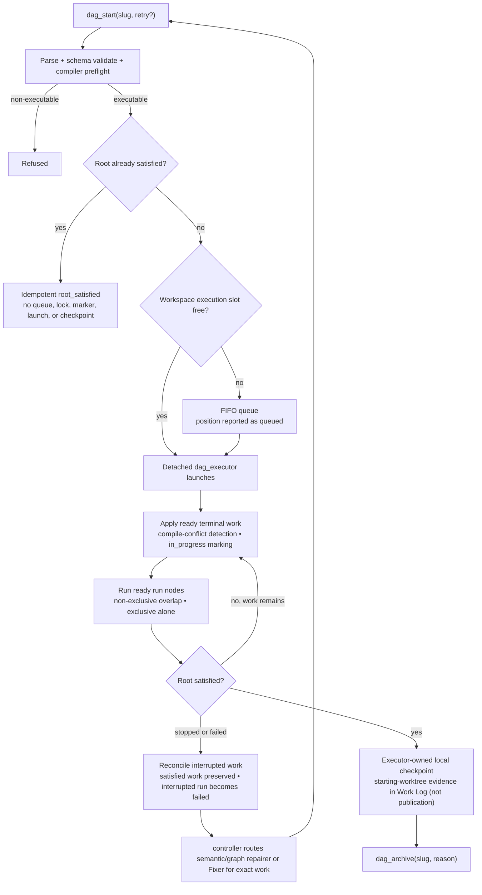

# Change DAG Lifecycle

How an accepted DD becomes an executable **Change DAG**, and how that DAG is executed, recovered, and archived.

Four roles, deliberately separated:

- `change-dag-author` performs one initial semantic `dag_create`, verifies creation, and exits. It never manages construction motion, dispatches Workers, reconciles, repairs, or executes.
- The controller owns serialized frontier motion, one opaque/session-bound Worker admission at a time, mandatory review, exact-work routing to `change-dag-fixer`, semantic/graph routing to `change-dag-semantic-repairer`, authority escalation, reconciliation, and final validation.
- `change-dag-worker` **lowers** one assigned semantic node into exact work, meaning decomposition, or lossless SCALE decomposition (per the `config/skills/change-dag-semantics/SKILL.md` doctrine), and may selectively dispatch the two read-only researchers; it is admitted only by the controller and retrieves its own scope with `dag_decomposition_scope`. It never manages the frontier, mutates source, or executes.
- `nyx` **operates** the lifecycle tools (`dag_start`, `dag_status`, `dag_stop`, `dag_archive`) and invokes the construction-control surface; it does not choose Workers, node IDs, or branches and does not make semantic construction decisions.
- `dag_executor` **applies** terminal work deterministically and serially.

The controller is the deterministic construction-control surface invoked by Nyx: the plugin tools `dag_construction_state`, `dag_construction_review`, `dag_construction_start`, and `dag_semantic_repair_start` (plus `dag_semantic_repair_resolve` for the repair child), implemented by `config/tools/common/tools/dag_construction_state.py`, `config/tools/common/tools/dag_construction_review.py`, and `config/tools/common/helpers/change_dag_controller.py`, with the native child adapter in `config/plugins/lib/construction-controller.ts`.

`incomplete-dag-reviewer` is bounded and read-only; the controller may select it for a construction question, and mandatory review follows each completed frontier. `change-dag-fixer` handles known exact-work defects, while `change-dag-semantic-repairer` handles bounded semantic/graph defects. The final `change-dag-reviewer` is optional, bounded, read-only, and selected by Nyx only for a completed, resolved, executable DAG when an observable coordination or authority trigger exists. Its evidence does not become DAG state. The controller consumes its disposition: `BLOCK_RUN` routes exact-work defects to Fixer, semantic/graph defects to the semantic repairer, and authority/DD problems upstream; `ALLOW_WITH_FOLLOWUP` permits execution while preserving evidence for post-run QA/follow-on repair; `ALLOW` is informational.

## Building the DAG

- The initial semantic structure is the smallest skeleton grounded in known correctness/causal structure, submitted atomically through `dag_create(slug, semantic_graph)`; the Author does not pre-size nodes for one Worker context. Semantic nodes express postconditions, not implementation actions. Worker-discovered breadth may be refined later through lossless SCALE decomposition. The canonical semantic-node doctrine (MEANING vs SCALE, parent/child completeness, sibling/causal semantics, semantic/terminal boundary) is `config/skills/change-dag-semantics/SKILL.md`.
- The DAG's only edge is `requires`, and it is ALL-of: `requires` expresses what must become true for a semantic requirement to be fulfilled. A semantic node is satisfied only when every node it directly requires is satisfied. Opaque branch components are serialized authoring units; nodes grouped in one branch are not necessarily independently dispatchable. The frontier service derives branches from the graph and never infers a missing causal relationship. If correct authoring of B requires accepted work from A, B must have a `requires` path to A rather than being treated as an independent sibling.
- Exact work is lowered one controller admission at a time, from the service-derived next branch. `dag_construction_state(slug)` returns the current decision, node/branch claim, and checkpoint identity; `dag_construction_start` mints capability references and admits exactly one worker for that claim in a serialized round with `slug + branch_ref + construction_ref + checkpoint_identity`; the Worker first calls `dag_worker_resolve` with the construction capability, and the service selects/binds the concrete node before `dag_decomposition_scope`. The controller re-queries after the batch, performs mandatory review, reconciles only when results or conflicts require it, and must not load the entire repository into one session.
- A semantic node may record persisted authoring intent with `dag_set_decomposition_only(slug, node_id, true)` when its obligation is fully decomposed into the semantic requirements it directly `requires` and it intentionally owns no direct terminal work. It is semantic-only: the node must directly require at least one semantic child, and a direct create/edit/remove/move/run child makes the DAG structurally invalid. `value=false` reopens the judgment. The field never affects runtime satisfaction, which still derives only from the satisfaction of `requires` children; only a bounded Worker or the bounded semantic repairer may call the setter.
- `dag_validate` reports `schema_valid`, `executable`, and `resolved`. A semantic node is locally resolved when it directly requires at least one terminal work node, or when it declares `decomposition_only=true` over semantic children only; `resolved` means every reachable semantic node is locally resolved. `executable` is the aggregate execution-admission/lint result: a DAG is executable only when it is structurally valid, `resolved`, and free of deterministic compiler/context admission conflicts. A DAG can be schema-valid and still unresolved; unresolved DAGs are valid authoring artifacts but are not executable.
- Construction review is mandatory after each completed frontier and is consumed by the controller. Nyx may additionally select final review for observable coordination or authority risks such as shared convergence, interface migrations, shared schemas, recovery amendments, or explicit user request. The Author surfaces `review_triggers`; neither the Author nor a Worker dispatches reviewers. The controller routes Fixer for known exact-work defects and the semantic repairer for semantic/graph defects.

## Executing the DAG

Key runtime facts:

- **One active executor per workspace.** The workspace execution lock is authoritative ownership/liveness; the PID is advisory control metadata. When the slot is busy, `dag_start` returns `queued` with a position.
- **An already-satisfied pending DAG is never relaunched.** When the root is already runtime-satisfied, `dag_start` returns an idempotent `root_satisfied` result before queueing, ownership, launch, or checkpointing. `retry=true` does not override it. Re-admitting a completed DAG would otherwise reach the executor-owned checkpoint path a second time and stage unrelated working-tree changes.
- **The queue is FIFO and duplicate-safe.** A slug already queued keeps its original position and request; it is not re-added.
- **Launch handoff is atomic.** Head selection, child launch, marker creation, and removal of exactly that entry happen under a short-lived queue lock, ordered after the execution lock, so a concurrent `dag_stop` cannot cause a removed DAG to launch or a different DAG to be dequeued.
- **`run` nodes are verification barriers.** They must not contain commit, push, PR, release, deploy, or other publication/lifecycle commands.
- **Detached execution with a synchronous fallback.** The executor runs out of band; a genuine detached-launch failure falls back synchronously.

## Status, stop, and recovery

Status values are `queued`, `running`, `root_satisfied`, and `idle`. There is no durable `quiescent` state.

- `dag_stop(slug)` is lifecycle control, not rollback. Satisfied work remains satisfied; a queued DAG can be removed. Interrupted mechanical work is reconciled; an interrupted `run` becomes failed.
- **A running DAG is immutable.** Do not mutate nodes or work while it runs.
- Recovery sequence: execution stops or fails → the executor reconciles interrupted work → the controller routes semantic/graph findings to `change-dag-semantic-repairer` or known exact-work defects to `change-dag-fixer` → `dag_validate` → `dag_start(slug, retry=true)` retries the whole DAG. There is no node- or subgraph-execution mode. Follow-on repair after the execution boundary is not a DAG amendment: normal work-routing sends small/local work direct, larger or cross-layer work to a new Change DAG, and architectural work to R&D.
- `anchor_commit` is provenance, not a commit binding. Live repository drift can produce ordinary terminal failure and recovery.

## Completion and archive

When the root becomes satisfied, the executor records inherited starting-worktree evidence and creates an executor-owned local checkpoint in the Work Log. Nyx does not create this checkpoint manually, and it is not publication.

A Change DAG bundle keeps construction and execution records separate: `DAG.json` is current construction state, `DAG_MUTATIONS.jsonl` is append-only construction provenance when present, `EXECUTION_STATE.json` is execution lifecycle state, and `WORK_LOG.jsonl` is execution evidence. Mutation entries identify the operation and sanitized arguments; the tool boundary records authenticated caller or agent identity when the service supplies it; direct calls remain explicitly unattributed rather than inferred. Provenance logging is enabled by default and can be disabled with `SKYSCOW_CHANGE_DAG_MUTATION_LOGGING=0`, `false`, or `off` without changing graph behavior. DAG persistence remains authoritative: if an enabled append fails after persistence, the mutation still returns success with metadata warning `mutation provenance was not recorded: ...`; no event is claimed as recorded. Sequence allocation inspects only a bounded tail of the JSONL file while holding the existing mutation lock. There is no agent-facing mutation-log reader tool. `dag_archive(slug, reason)` retires a pending bundle into `artifacts/change-dags/archived/`, moving all bundle files—including `DAG_MUTATIONS.jsonl` when present—and writes an `ARCHIVE.json` disposition record (`archived_at`, `reason`, `state_at_archive`, `artifacts_moved`) before the move. `DAG_MUTATIONS.jsonl` is never merged into `WORK_LOG.jsonl`.

Archival is lifecycle cleanup, not certification: a DAG may be archived after success, failure, abandonment, supersession, or cancellation, and the move implies none of those. It does **not** require `resolved`, `executable`, root satisfaction, an absence of failed nodes, or QA. Only operational-integrity gates apply: a running DAG must be stopped first, and a queued DAG must be cancelled with `dag_stop` before it can be archived. Derive whether execution completed from the recorded state, never from archive membership.

## QA boundary

QA is not a Change DAG phase and is not an archive gate. An archived DAG is never reopened for QA: use a bounded raw repair for a small defect, or a new remediation Change DAG for a substantial or cross-cutting defect.

## Canonical sources

- `config/agents/change-dag-author.md` — initial semantic creation and controller handoff
- `config/agents/change-dag-worker.md` — bounded single-semantic-node lowering/decomposition
- `config/skills/change-dag-lifecycle/SKILL.md` — lifecycle operation
- `config/skills/change-dag-semantics/SKILL.md` — canonical semantic-node doctrine
- `config/tools/common/tools/dag_start.py`, `dag_status.py`, `dag_stop.py`, `dag_archive.py` — lifecycle tools
- `config/tools/common/tools/dag_executor.py`, `config/tools/common/helpers/change_dag_control.py` — execution and queue control
- `config/tools/common/tools/dag_construction_state.py`, `config/tools/common/tools/dag_construction_review.py`, `config/tools/common/helpers/change_dag_controller.py`, `config/plugins/lib/construction-controller.ts` — deterministic construction-control surface invoked by Nyx
