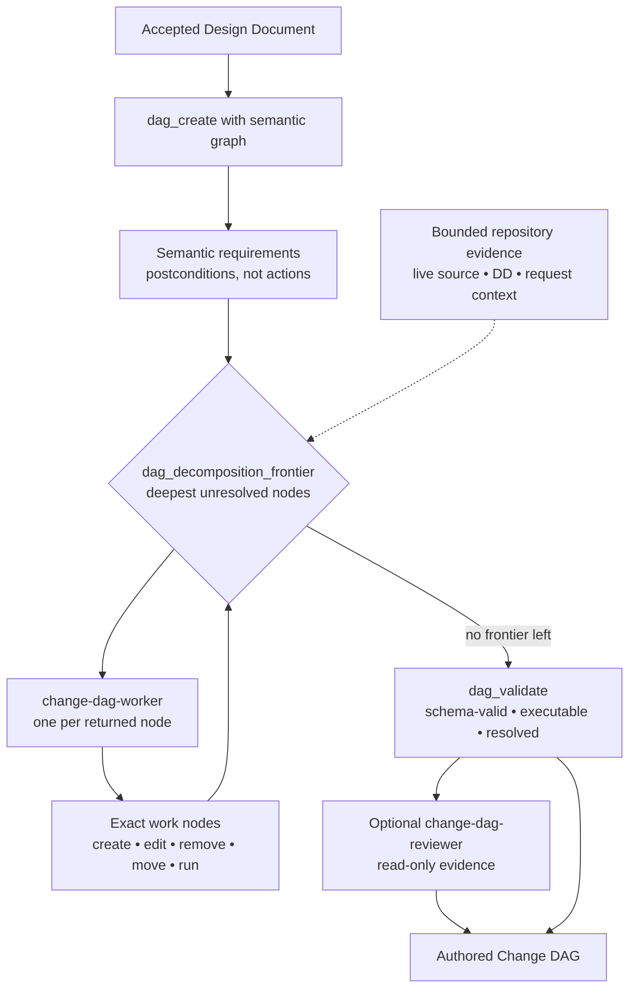
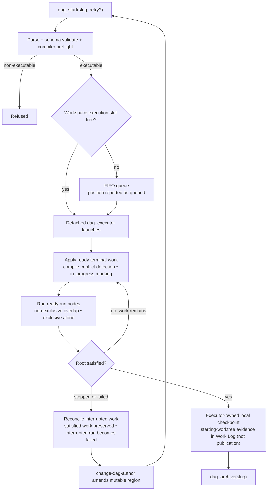

# Change DAG Lifecycle

How an accepted DD becomes an executable **Change DAG**, and how that DAG is executed, recovered, and archived.

Four roles, deliberately separated:

- `change-dag-author` **constructs** the DAG — manager role: semantic graph, service-derived decomposition-frontier loop, reconciliation, validation — and amends mutable work during recovery. It never executes.
- `change-dag-worker` **lowers** one assigned semantic node into exact work or further decomposition, dispatched internally by the author manager; it retrieves its own scope with `dag_decomposition_scope`. It never manages the frontier, mutates source, or executes.
- `nyx` **operates** the lifecycle tools (`dag_start`, `dag_status`, `dag_stop`, `dag_archive`).
- `dag_executor` **applies** terminal work deterministically and serially.

`change-dag-reviewer` is optional, bounded, and read-only, selected by Nyx. A reviewer `PASS` is evidence only; it does not authorize execution.

## Building the DAG

- The initial semantic structure is submitted atomically through `dag_create(slug, semantic_graph)`. Semantic nodes express postconditions, not implementation actions.
- The DAG's only edge is `requires`, and it is ALL-of: `requires` expresses what must become true for a semantic requirement to be fulfilled. A semantic node is satisfied only when every node it directly requires is satisfied. Nodes on the same semantic frontier assert authoring independence; the frontier service derives the frontier from `requires` edges only and never infers a missing causal relationship. Semantic siblings imply no authoring dependency through each other; if correct authoring of B requires accepted work from A, B must have a `requires` path to A rather than being represented as an independent sibling.
- Exact work is lowered one **decomposition frontier** at a time, from the deepest semantic nodes upward. The author manager queries `dag_decomposition_frontier(slug)` and dispatches one fresh bounded `change-dag-worker` per returned node; a frontier is the service-derived scheduling/reconciliation unit and a semantic node is the worker/context unit. The Worker retrieves its own scope with `dag_decomposition_scope(slug, node_id)`. The author reconciles only when results or conflicts require it, re-queries the frontier rather than tracking progress locally, and must not load the entire repository into one session.
- A semantic node may record persisted authoring intent with `dag_set_decomposition_only(slug, node_id, true)` when its obligation is fully decomposed into the semantic requirements it directly `requires` and it intentionally owns no direct terminal work. It is semantic-only: the node must directly require at least one semantic child, and a direct create/edit/remove/move/run child makes the DAG structurally invalid. `value=false` reopens the judgment. The field never affects runtime satisfaction, which still derives only from the satisfaction of `requires` children; only a bounded worker may call the setter.
- `dag_validate` reports `schema_valid`, `executable`, and `resolved`. A semantic node is locally resolved when it directly requires at least one terminal work node, or when it declares `decomposition_only=true` over semantic children only; `resolved` means every reachable semantic node is locally resolved. A DAG can be schema-valid and still unresolved — unresolved semantic nodes do not necessarily make it non-executable.
- Optional review may be selected by Nyx for observable coordination or authority risks such as shared convergence, interface migrations, shared schemas, recovery amendments, or explicit user request. The author surfaces `review_triggers`; neither the author nor a worker dispatches the reviewer.

## Executing the DAG

Key runtime facts:

- **One active executor per workspace.** The workspace execution lock is authoritative ownership/liveness; the PID is advisory control metadata. When the slot is busy, `dag_start` returns `queued` with a position.
- **The queue is FIFO and duplicate-safe.** A slug already queued keeps its original position and request; it is not re-added.
- **Launch handoff is atomic.** Head selection, child launch, marker creation, and removal of exactly that entry happen under a short-lived queue lock, ordered after the execution lock, so a concurrent `dag_stop` cannot cause a removed DAG to launch or a different DAG to be dequeued.
- **`run` nodes are verification barriers.** They must not contain commit, push, PR, release, deploy, or other publication/lifecycle commands.
- **Detached execution with a synchronous fallback.** The executor runs out of band; a genuine detached-launch failure falls back synchronously.

## Status, stop, and recovery

Status values are `queued`, `running`, `root_satisfied`, and `idle`. There is no durable `quiescent` state.

- `dag_stop(slug)` is lifecycle control, not rollback. Satisfied work remains satisfied; a queued DAG can be removed. Interrupted mechanical work is reconciled; an interrupted `run` becomes failed.
- **A running DAG is immutable.** Do not mutate nodes or work while it runs.
- Recovery sequence: execution stops or fails → the executor reconciles interrupted work → `change-dag-author` amends the mutable failed/unresolved region → `dag_validate` → `dag_start(slug, retry=true)` retries the whole DAG. There is no node- or subgraph-execution mode.
- `anchor_commit` is provenance, not a commit binding. Live repository drift can produce ordinary terminal failure and recovery.

## Completion and archive

When the root becomes satisfied, the executor records inherited starting-worktree evidence and creates an executor-owned local checkpoint in the Work Log. Nyx does not create this checkpoint manually, and it is not publication.

`dag_archive(slug)` requires the DAG to be pending, root-satisfied, and free of failed or in-progress terminal nodes. Archival does **not** depend on QA.

## QA boundary

QA is not a Change DAG phase and is not an archive gate. A completed DAG is never reopened for QA: use a bounded raw repair for a small defect, or a new remediation Change DAG for a substantial or cross-cutting defect.

## Canonical sources

- `config/agents/change-dag-author.md` — construction management, frontiers, amendment
- `config/agents/change-dag-worker.md` — bounded single-semantic-node lowering/decomposition
- `config/skills/change-dag-lifecycle/SKILL.md` — lifecycle operation
- `config/tools/common/tools/dag_start.py`, `dag_status.py`, `dag_stop.py`, `dag_archive.py` — lifecycle tools
- `config/tools/common/tools/dag_executor.py`, `config/tools/common/helpers/change_dag_control.py` — execution and queue control
