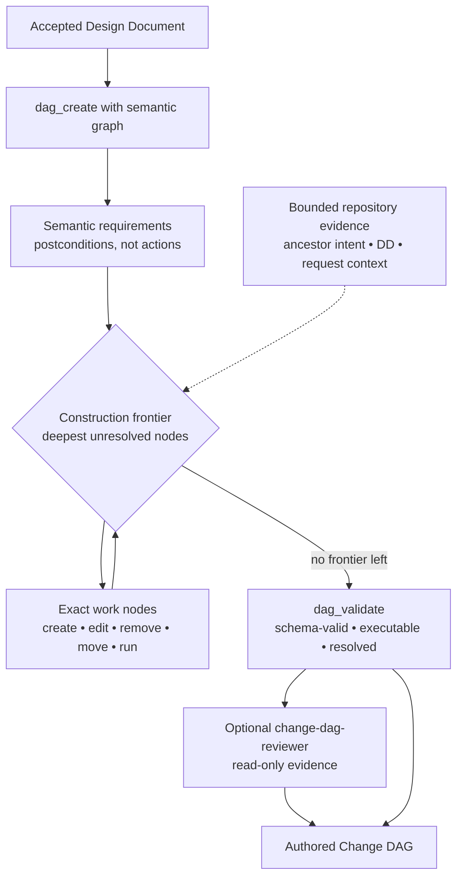
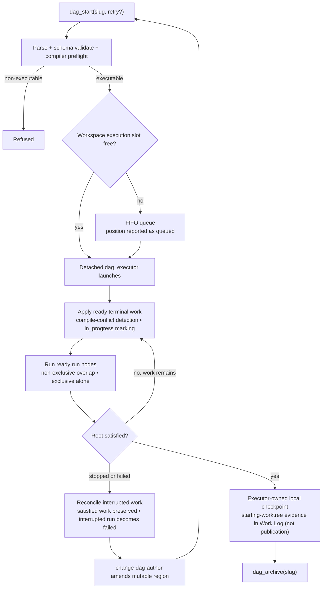

# Change DAG Lifecycle

How an accepted DD becomes an executable **Change DAG**, and how that DAG is executed, recovered, and archived.

Three owners, deliberately separated:

- `change-dag-author` **constructs** the DAG and amends mutable work during recovery. It never executes.
- `nyx` **operates** the lifecycle tools (`dag_start`, `dag_status`, `dag_stop`, `dag_archive`).
- `dag_executor` **applies** terminal work deterministically and serially.

`change-dag-reviewer` is optional, bounded, and read-only. A reviewer `PASS` is evidence only; it does not authorize execution.

## Building the DAG

- The initial semantic structure is submitted atomically through `dag_create(slug, semantic_graph)`. Semantic nodes express postconditions, not implementation actions.
- Exact work is lowered one **construction frontier** at a time, from the deepest semantic nodes upward. Each frontier gets a fresh bounded author invocation; the author must not load the entire repository into one session.
- `dag_validate` reports `schema_valid`, `executable`, and `resolved`. A DAG can be schema-valid and still unresolved — unresolved semantic leaves do not necessarily make it non-executable.
- Optional review may be selected for observable coordination or authority risks such as shared convergence, interface migrations, shared schemas, recovery amendments, or explicit user request.

## Executing the DAG

Key runtime facts:

- **One active executor per workspace.** The workspace execution lock is authoritative ownership/liveness; the PID is advisory control metadata. When the slot is busy, `dag_start` returns `queued` with a position.
- **The queue is FIFO and duplicate-safe.** A slug already queued keeps its original position and request; it is not re-added.
- **Launch handoff is atomic.** Head selection, child launch, marker creation, and removal of exactly that entry happen under a short-lived queue lock, ordered after the execution lock, so a concurrent `dag_stop` cannot cause a removed DAG to launch or a different DAG to be dequeued.
- **`run` nodes are verification barriers.** They must not contain commit, push, PR, release, deploy, or other publication/lifecycle commands.
- **Detached execution with a synchronous fallback.** The executor runs out of band; a genuine detached-launch failure falls back synchronously.

## Status, stop, and recovery

Status values are `queued`, `running`, `root_satisfied`, and `idle`. There is no durable `quiescent` state.

- `dag_stop(slug)` is lifecycle control, not rollback. Satisfied work remains satisfied; a queued DAG can be removed. Interrupted mechanical work is reconciled; an interrupted `run` becomes failed.
- **A running DAG is immutable.** Do not mutate nodes or work while it runs.
- Recovery sequence: execution stops or fails → the executor reconciles interrupted work → `change-dag-author` amends the mutable failed/unresolved region → `dag_validate` → `dag_start(slug, retry=true)` retries the whole DAG. There is no node- or subgraph-execution mode.
- `anchor_commit` is provenance, not a commit binding. Live repository drift can produce ordinary terminal failure and recovery.

## Completion and archive

When the root becomes satisfied, the executor records inherited starting-worktree evidence and creates an executor-owned local checkpoint in the Work Log. Nyx does not create this checkpoint manually, and it is not publication.

`dag_archive(slug)` requires the DAG to be pending, root-satisfied, and free of failed or in-progress terminal nodes. Archival does **not** depend on QA.

## QA boundary

QA is not a Change DAG phase and is not an archive gate. A completed DAG is never reopened for QA: use a bounded raw repair for a small defect, or a new remediation Change DAG for a substantial or cross-cutting defect.

## Canonical sources

- `config/agents/change-dag-author.md` — construction, frontiers, amendment
- `config/skills/change-dag-lifecycle/SKILL.md` — lifecycle operation
- `config/tools/common/tools/dag_start.py`, `dag_status.py`, `dag_stop.py`, `dag_archive.py` — lifecycle tools
- `config/tools/common/tools/dag_executor.py`, `config/tools/common/helpers/change_dag_control.py` — execution and queue control
