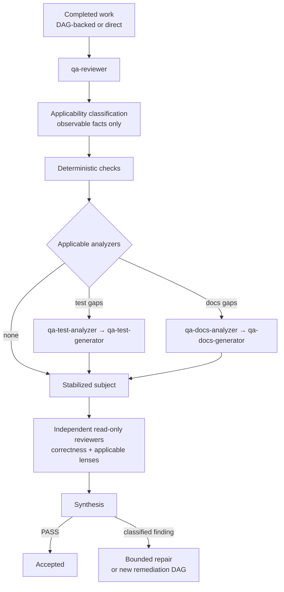

# QA and Publication

Independent review and publication gating are separate from Change DAG execution. QA is not a DAG phase, not stored in `EXECUTION_STATE`, and not an archive gate.

## Normal QA

`qa-reviewer` runs one composition pass over the changed surface. It does not fix issues; it classifies findings and routes repair.

- **Correctness is always required** for a meaningful implementation or policy behavior change. Boundary, journey, domain-risk, tests, and docs are independently conditional on observable triggers. None excuses another.
- Boundary, journey, and domain-risk lenses follow the applicability table. Matched domain-risk lenses run in canonical batches of at most three; every matched lens must run.
- Test and docs analyzers each own one generator cycle and return `PASS`, `GENERATED`, or `FAIL`. A failed or malformed analyzer result blocks terminal `PASS`.
- Specialist reviewers receive one immutable, stabilized context and do not consume one another's results.

## Two publication paths

These are different workflows and should not be conflated: the push gate reviews an **immutable candidate commit**, while whole-tree review examines a **complete remote tree**.

```mermaid
flowchart TD
    subgraph PUSH["/qa-push — candidate publication gate"]
        CAND["Candidate commit SHA"] --> SNAP["Isolated detached snapshot"]
        SNAP --> G1["Gate 1 static validation"]
        G1 --> G2["Gate 2 builds"]
        G2 --> G3["Gate 3 tests"]
        G3 --> G4["Gate 4 adversarial review"]
        G4 --> G5["Gate 5 exact-SHA integrity"]
        G5 -->|verified blocks_push and push_authorized| PUSHED["Push exact SHA"]
        G5 -->|not authorized| VALONLY["Validation only"]
    end

    subgraph TREE["/qa-repo-review — whole-tree review"]
        URL["Explicit GitHub tree URL"] --> REF["Resolve exact ref"]
        REF --> SNAP2["Immutable detached whole tree"]
        SNAP2 --> RREV["Whole-tree reviewers"]
        RREV --> MODE["report / dry-run / submit"]
    end
```

### `/qa-push`

`qa-push-manager` is the final gate between completed local work and the remote.

- The artifact under review is the immutable commit at `candidate_sha`, never the mutable developer workspace. Validation runs in a disposable detached snapshot that the manager creates and owns.
- Gates run cheapest-first: static validation → builds → tests → adversarial review → final integrity. A deterministic failure stops the workflow immediately; reviewer resources are not spent on it.
- Reviewer infrastructure failure is fail-closed: a partial reviewer result is insufficient.
- Severity does not block publication by itself. Only independently verified findings with `blocks_push: true` do.
- Push happens only for the exact commit object that passed validation, only when `push_authorized` is exactly `true`, and only after re-verifying the snapshot, remote, and target branch. Otherwise the outcome is validation-only.

### `/qa-repo-review`

`qa-repo-review-manager` reviews a complete repository tree at an explicitly given full HTTPS tree URL.

- It resolves the exact ref at run start and reviews the complete tree at that resolved head from an immutable detached snapshot. It never reviews a diff or candidate commit and **never pushes**.
- Modes: `report` (no-write, default), `dry-run` (read-only publication proposal), and `submit` (explicitly authorized issue publication). Issue publication is not Git push publication.

## Canonical sources

- `config/agents/qa-reviewer.md` — one-pass composition and finding classification
- `config/instructions/qa-applicability.md` — canonical lens applicability
- `config/agents/qa-push-manager.md` — candidate push gates
- `config/agents/qa-repo-review-manager.md` — whole-tree review
