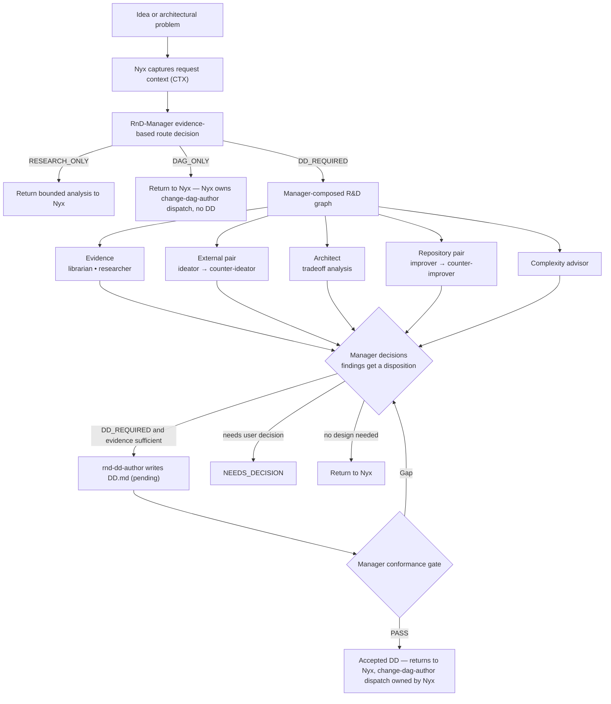

# R&D and Design Documents

How an idea or architectural problem becomes a **Design Document (DD)**.

Nyx decides whether R&D evaluation is required; it does not predeclare the route. `rnd-manager` owns the evidence-based route (`DAG_ONLY` / `DD_REQUIRED` / `RESEARCH_ONLY`), the R&D graph, the requirement ledger, risk dispositions, and DD acceptance, and returns the structured result to Nyx. Nyx owns the downstream `change-dag-author` dispatch. `rnd-dd-author` writes the DD but does not orchestrate, reinterpret, or repair earlier decisions.



## Authority boundaries

- The original user request is the authoritative product specification. The Manager extracts an **immutable requirement ledger** and passes it unchanged downstream. Findings, recommendations, and estimates never become requirements or authorization on their own.
- A missing or unreadable `artifacts/requests/CTX_*.md` snapshot blocks DD authoring.
- `rnd-refiner` runs exactly one Manager-selected adversarial pair per invocation. It does not choose the architecture, decide dispositions, or authorize implementation.
- Material adversarial findings return to the Manager, which assigns exactly one disposition: `MITIGATE`, `ACCEPT_RISK`, `NOT_APPLICABLE`, or `DEFER_TO_OWNER`. Only `MITIGATE` authorizes a bounded correction.
- `support-pattern-enforcer` output is advisory evidence; it does not authorize implementation.
- Nyx's pre-dispatch responsibility is bounded: recognize that R&D evaluation is warranted, preserve the authoritative request, capture `request_context`, and pass already-known constraints and evidence. RnD-Manager owns selection of the design-evidence graph (governance skills, librarian, researcher, and other R&D capabilities); Nyx does not complete a duplicate broad discovery pass first, already-known evidence is passed rather than discarded, and neither side is required to independently read the same governance corpus.

## Route decision

For a new design request, `rnd-estimator` runs first unless the user explicitly asks for a DD. Nyx routes the request to `rnd-manager` for evaluation without predeclaring the route; architectural novelty routes here even when exact edit locations are already known:

| Route | Meaning |
|---|---|
| `DAG_ONLY` | Return to Nyx; do not create a DD. Nyx dispatches `change-dag-author`. Success handoff: `status: DONE`, `phase: READY_FOR_AUTHORING`. |
| `DD_REQUIRED` | Compose a DD graph; an explicit DD request selects this directly. A completed DD returns to Nyx as `status: DONE`, `phase: READY_FOR_AUTHORING`; Nyx dispatches `change-dag-author` with the accepted DD context. |
| `RESEARCH_ONLY` | Return bounded analysis to Nyx and stop — no partial DD, and no DD, Change DAG, or implementation-authorization implication. |

The route is not a fixed worker list. The Manager selects only capabilities whose inputs are missing or whose bounded challenge is useful, and records a short rationale for each selected or materially skipped capability.

## Conditional capabilities

| Capability | Selected when |
|---|---|
| `support-librarian` | Prior process artifacts (DDs, logs, dead ends) materially constrain the design; governing decisions/requirements come from the `architecture-decisions`/`system-requirements` skills |
| `support-researcher` | Repository integration points or external/API facts are unknown or need verification |
| External pair (`rnd-ideator` → `rnd-counter-ideator`) | External technology or approach space is open and consequential |
| `rnd-architect` | Multiple credible survivors still need concrete implementation tradeoffs |
| Repository pair (`rnd-improver` → `rnd-counter-improver`) | An accepted direction needs repository-native adaptation and its fit warrants challenge |
| `rnd-complexity-advisor` | The design introduces meaningful abstraction, lifecycle, dependency, compatibility, registry, or scope complexity |
| `rnd-estimator` | Early route selection, or a later estimate is useful downstream |

Genuinely independent librarian and researcher work may run concurrently; dependent nodes stay ordered. The external pair may return zero, one, or multiple surviving approaches with evidence. The Manager or the user selects one accepted direction before any repository pair runs.

## Design document authoring

`rnd-dd-author` is invoked only after the selected inputs exist and Manager decisions are resolved. It writes a single DD to:

```text
artifacts/designs/pending/{slug}/DD.md
```

It may record only Manager-authorized bounded corrections. Missing selected inputs block authoring; it does not spawn replacement agents.

## Acceptance

Before accepting, the Manager compares the captured request context, the immutable ledger, accepted constraints, selected reports, adversarial outcomes, dispositions, and the final DD. The completion gate requires every material finding to have a disposition and every ledger item to map to the DD.

An accepted DD is `Complete (accepted)`, `Approved`, or `Completed`. An accepted DD may remain in `pending/` only if it names a prerequisite disposition, an owner, and a transition condition; otherwise it is stale and cannot proceed to decomposition, execution, or archival.

## Canonical sources

- `config/agents/nyx.md` — top-level orchestration and the request-context gate
- `config/skills/work-routing/SKILL.md` — canonical routing (owner-selection) policy
- `config/agents/rnd-manager.md` — graph composition, dispositions, conformance gate
- `config/agents/rnd-refiner.md` — bounded adversarial pair execution
- `config/agents/rnd-dd-author.md` — DD authoring
- `config/skills/dispatching-agents/SKILL.md` — dispatch contracts and accepted-DD statuses
